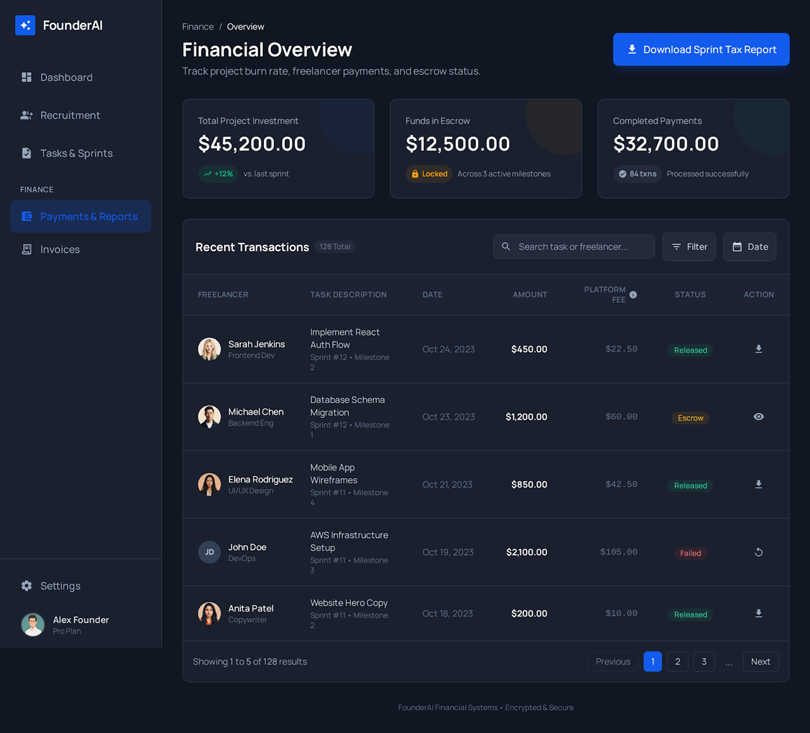
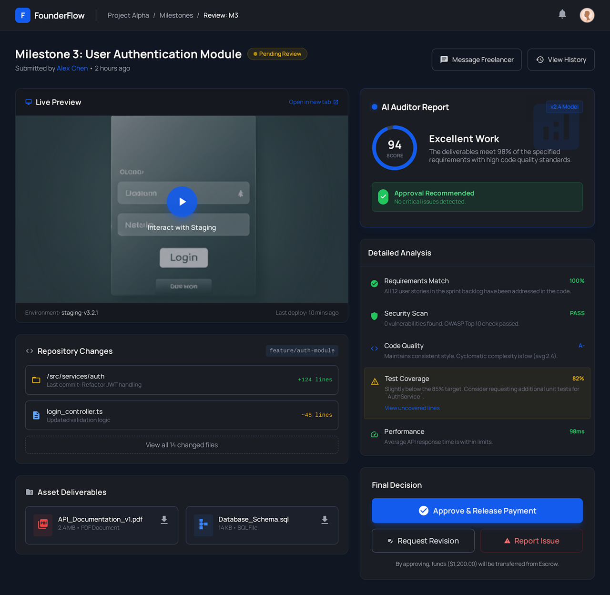
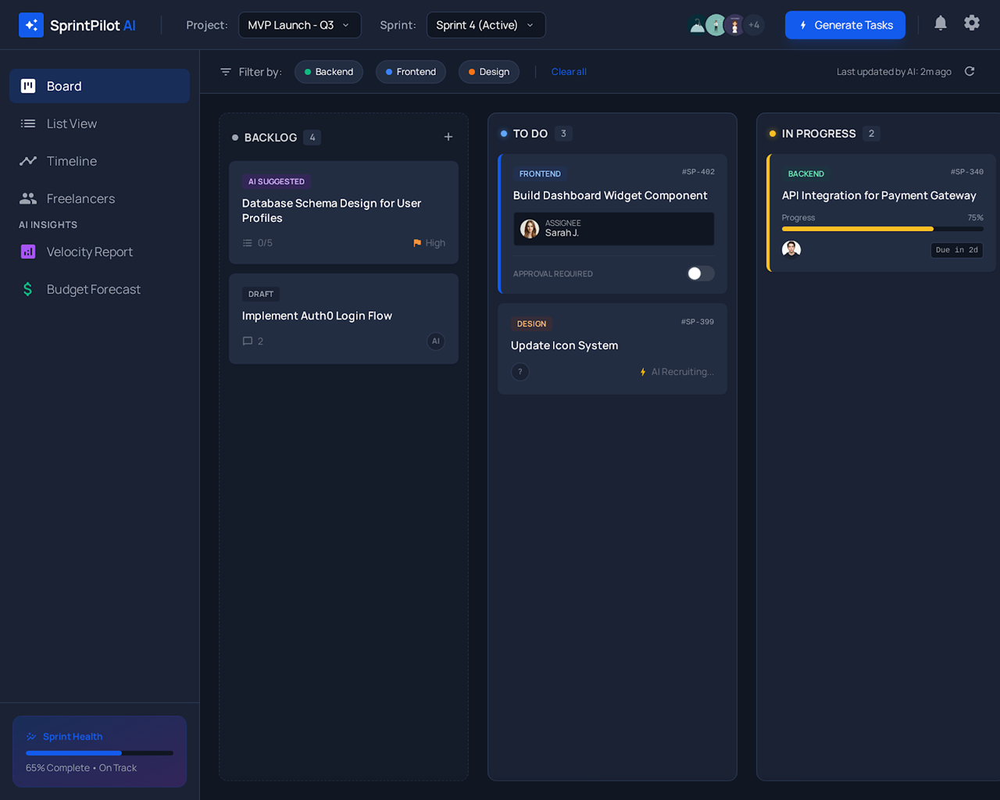

# Design Document: Team Foundry

## Overview

Team Foundry is a single-page web application that transforms project ideas into executable roadmaps and learning-oriented development plans that accelerate developer productivity, with AI-recommended team candidates. The system follows a linear flow: idea input → AI analysis → roadmap generation → candidate recommendation → human team selection.

The architecture emphasizes simplicity for the hackathon MVP, using a client-server model where the frontend handles user interaction and display, while the backend orchestrates AI processing and data retrieval. The system maintains session-based state without requiring user authentication.

Key design principles:
- **Human-in-the-loop**: AI recommends, humans decide
- **Speed**: Complete flow in under 60 seconds
- **Simplicity**: Single-page experience with minimal navigation
- **Transparency**: Clear feedback at each step
- **Productivity-first**: Reduce time from idea to development start

## Architecture

### System Components

```
┌─────────────────────────────────────────────────────────────┐
│                   Frontend (React + Memstack)               │
│  ┌──────────────┐  ┌──────────────┐  ┌──────────────┐       │
│  │ Idea Input   │  │   Roadmap    │  │   Team       │       │
│  │ Component    │→ │   Display    │→ │   Builder    │       │
│  └──────────────┘  └──────────────┘  └──────────────┘       │
│                                                             │
│  ┌─────────────────────────────────────────────────────┐    │
│  │              Memstack State Management              │    │
│  │  • Session state (roadmap, candidates, team)        │    │
│  │  • API integration layer                            │    │
│  │  • Client-side persistence                          │    │
│  └─────────────────────────────────────────────────────┘    │
└─────────────────────────────────────────────────────────────┘
                            ↓ HTTP/REST
┌─────────────────────────────────────────────────────────────┐
│                      Backend API Server                     │
│  ┌──────────────┐  ┌──────────────┐  ┌──────────────┐       │
│  │   Roadmap    │  │  Candidate   │  │   Session    │       │
│  │   Service    │  │   Service    │  │   Manager    │       │
│  └──────────────┘  └──────────────┘  └──────────────┘       │
└─────────────────────────────────────────────────────────────┘
                            ↓
┌─────────────────────────────────────────────────────────────┐
│                    External Dependencies                    │
│  ┌──────────────┐  ┌──────────────┐                         │
│  │  AI/LLM API  │  │  Candidate   │                         │
│  │  (OpenAI)    │  │  Database    │                         │
│  └──────────────┘  └──────────────┘                         │
└─────────────────────────────────────────────────────────────┘
```

### Component Responsibilities

**Frontend Components (React + Memstack):**
- **Idea Input Component**: Captures project description, validates minimum length, triggers roadmap generation
- **Roadmap Display Component**: Renders structured roadmap (summary, features, roles, tech stack, phases)
- **Team Builder Component**: Displays candidate cards, handles selection/deselection, shows current team
- **Memstack State Layer**: Manages application state (roadmap, candidates, team selection), handles API calls, provides reactive state updates to components

**Backend Services:**
- **Roadmap Service**: Interfaces with AI/LLM to generate structured roadmaps from project ideas
- **Candidate Service**: Retrieves and ranks candidates from database based on required roles
- **Session Manager**: Maintains session state (roadmap, team selection) without authentication

**External Dependencies:**
- **AI/LLM API**: Generates roadmaps from natural language input (e.g., OpenAI GPT-4)
- **Candidate Database**: Stores predefined candidate profiles with skills, experience, and cost data

## Components and Interfaces

### Memstack State Management

Memstack will handle all application state and API interactions. The state structure:

```typescript
// Memstack state schema
interface AppState {
  session: {
    sessionId: string | null;
    status: 'idle' | 'generating' | 'complete' | 'error';
    error: string | null;
  };
  projectIdea: string;
  roadmap: ExecutionRoadmap | null;
  candidates: Map<string, CandidateProfile[]>;
  teamSelection: Set<string>;
}

// Memstack actions
const actions = {
  setProjectIdea: (idea: string) => void;
  submitIdea: () => Promise<void>;
  selectCandidate: (candidateId: string) => void;
  removeCandidate: (candidateId: string) => void;
  retryGeneration: () => Promise<void>;
  loadSession: (sessionId: string) => Promise<void>;
};
```

### Frontend API Client

```typescript
interface IdeaSubmissionRequest {
  projectIdea: string;
  sessionId?: string;
}

interface ExecutionRoadmap {
  projectSummary: string;
  coreFeatures: string[];
  requiredRoles: RequiredRole[];
  technologyStack: string[];
  developmentPhases: DevelopmentPhase[];
}

interface RequiredRole {
  title: string;
  description: string;
  requiredSkills: string[];
}

interface DevelopmentPhase {
  name: string;
  description: string;
  estimatedDuration: string;
}

interface CandidateProfile {
  id: string;
  name: string;
  skills: string[];
  experienceYears: number;
  costRange: CostRange;
  matchScore: number;
  bio: string;
}

interface CostRange {
  min: number;
  max: number;
  currency: string;
}

interface TeamSelection {
  sessionId: string;
  selectedCandidates: CandidateProfile[];
}
```

### Backend API Endpoints

```
POST /api/roadmap
  Request: { projectIdea: string, sessionId?: string }
  Response: { 
    sessionId: string,
    roadmap: ExecutionRoadmap,
    candidates: { [roleTitle: string]: CandidateProfile[] }
  }

POST /api/team/select
  Request: { sessionId: string, candidateId: string }
  Response: { teamSelection: TeamSelection }

POST /api/team/remove
  Request: { sessionId: string, candidateId: string }
  Response: { teamSelection: TeamSelection }

GET /api/session/:sessionId
  Response: {
    roadmap: ExecutionRoadmap,
    candidates: { [roleTitle: string]: CandidateProfile[] },
    teamSelection: TeamSelection
  }
```

### Roadmap Service Interface

```typescript
interface IRoadmapService {
  generateRoadmap(projectIdea: string): Promise<ExecutionRoadmap>;
}

class AIRoadmapService implements IRoadmapService {
  constructor(private aiClient: IAIClient) {}
  
  async generateRoadmap(projectIdea: string): Promise<ExecutionRoadmap> {
    // Construct prompt for AI
    // Call AI API
    // Parse and validate response
    // Return structured roadmap
  }
}
```

### Candidate Service Interface

```typescript
interface ICandidateService {
  findCandidatesForRole(
    role: RequiredRole,
    count: number
  ): Promise<CandidateProfile[]>;
  
  calculateMatchScore(
    candidate: CandidateProfile,
    role: RequiredRole
  ): number;
}

class CandidateService implements ICandidateService {
  constructor(private database: ICandidateDatabase) {}
  
  async findCandidatesForRole(
    role: RequiredRole,
    count: number
  ): Promise<CandidateProfile[]> {
    // Query database for candidates with matching skills
    // Calculate match scores
    // Sort by match score descending
    // Return top N candidates
  }
}
```

### Session Manager Interface

```typescript
interface ISessionManager {
  createSession(): string;
  storeRoadmap(sessionId: string, roadmap: ExecutionRoadmap): void;
  storeCandidates(sessionId: string, candidates: Map<string, CandidateProfile[]>): void;
  getSession(sessionId: string): SessionData | null;
  addToTeam(sessionId: string, candidateId: string): TeamSelection;
  removeFromTeam(sessionId: string, candidateId: string): TeamSelection;
}

interface SessionData {
  roadmap: ExecutionRoadmap;
  candidates: Map<string, CandidateProfile[]>;
  teamSelection: Set<string>;
  createdAt: Date;
}
```

## Data Models

### ExecutionRoadmap

Represents the AI-generated project plan.

```typescript
class ExecutionRoadmap {
  projectSummary: string;
  coreFeatures: string[];
  requiredRoles: RequiredRole[];
  technologyStack: string[];
  developmentPhases: DevelopmentPhase[];
  
  validate(): boolean {
    return this.projectSummary.length > 0 &&
           this.coreFeatures.length > 0 &&
           this.requiredRoles.length > 0 &&
           this.technologyStack.length > 0 &&
           this.developmentPhases.length > 0;
  }
}
```

### CandidateProfile

Represents a potential team member with skills and cost information.

```typescript
class CandidateProfile {
  id: string;
  name: string;
  skills: string[];
  experienceYears: number;
  costRange: CostRange;
  matchScore: number;
  bio: string;
  
  hasSkill(skill: string): boolean {
    return this.skills.some(s => 
      s.toLowerCase().includes(skill.toLowerCase())
    );
  }
}
```

### Match Score Calculation

The match score algorithm evaluates how well a candidate fits a required role:

```typescript
function calculateMatchScore(
  candidate: CandidateProfile,
  role: RequiredRole
): number {
  let score = 0;
  const maxScore = 100;
  
  // Skill matching (70% weight)
  const matchedSkills = role.requiredSkills.filter(skill =>
    candidate.hasSkill(skill)
  );
  const skillScore = (matchedSkills.length / role.requiredSkills.length) * 70;
  score += skillScore;
  
  // Experience bonus (30% weight)
  // 0-2 years: 0 points
  // 3-5 years: 15 points
  // 6-10 years: 25 points
  // 10+ years: 30 points
  if (candidate.experienceYears >= 10) score += 30;
  else if (candidate.experienceYears >= 6) score += 25;
  else if (candidate.experienceYears >= 3) score += 15;
  
  return Math.min(score, maxScore);
}
```





## System Architecture

The platform follows a modular, service-oriented architecture combining AI orchestration, automation agents, and core project management services.

### High-Level Layers

* **Frontend Layer**
  Interfaces for founders, freelancers, and admins built with a reactive web framework.

* **Backend API Layer**
  Handles authentication, project management, sprint logic, reporting, and integrations.

* **AI Orchestration Layer**
  Responsible for idea analysis, task decomposition, candidate matching, and decision support.

* **Automation Agent Layer**
  Browser-based agents that interact with external freelance platforms for discovery and communication.

* **Data Layer**
  Persistent storage for users, projects, tasks, candidates, sprints, reports, and payments.

---

## Core Components

### Idea Intake & Feasibility Engine

**Purpose:** Convert founder input into structured project understanding.
**Inputs:** Founder idea, optional constraints, budget, timeline.
**Outputs:**

* Feasibility score
* Risk indicators
* High-level architecture outline

**Design Notes:**

* Uses LLM reasoning with validation rules.
* Stores versioned analysis for traceability.

---

### Task Breakdown Engine

**Purpose:** Transform validated ideas into executable work units.
**Outputs:**

* Hierarchical task tree
* Dependencies
* Estimated effort
* Required roles

**Design Notes:**

* Combines prompt-driven AI with rule-based normalization.
* Produces sprint-ready backlog.

---

### Candidate Discovery Agent

**Purpose:** Identify and contact suitable freelancers automatically.

**Subcomponents:**

* Platform crawler (Playwright automation)
* Profile parser and scorer
* Messaging automation
* Shortlist generator

**Flow:**

1. Receive required roles and skills.
2. Search external platforms.
3. Score candidates via AI ranking.
4. Send outreach messages.
5. Return shortlist for approval.

---

### Human Approval Interface

**Purpose:** Keep founders in control of hiring decisions.

**Capabilities:**

* View ranked candidates
* Inspect profiles and history
* Approve or reject
* Trigger recruitment finalization

---

### Sprint Management Engine

**Purpose:** Coordinate execution after hiring.

**Responsibilities:**

* Convert backlog into sprints
* Assign tasks to freelancers
* Track status, submissions, and revisions
* Maintain timeline and blockers

**State Model:**

* Planned → Active → Review → Completed

---

### Progress Evaluation & Reporting

**Purpose:** Provide transparency and accountability.

**Generated Artifacts:**

* Sprint summary
* Completion metrics
* Budget consumption
* Remaining workload

**Design Notes:**

* Reports are immutable once finalized.
* Historical comparison across sprints supported.

---

### Payment Management System

**Purpose:** Ensure fair and traceable compensation.

**Functions:**

* Track earnings per task and sprint
* Maintain escrow-style allocation (logical or integrated)
* Release payments after approval
* Provide transaction history

---

### Authentication & Authorization

**Roles:**

* Founder
* Freelancer
* Admin

**Design:**

* Token-based authentication with refresh flow.
* Role-based access control at API and UI levels.

---

## Data Model Overview

### Core Entities

* **User** (role, profile, credentials)
* **Project** (idea, feasibility, status, budget)
* **Task** (description, role, estimate, dependency, status)
* **Sprint** (timebox, tasks, progress, report)
* **Candidate** (source platform, score, approval state)
* **Payment** (amount, milestone, release status)
* **Report** (metrics, cost, summary)

### Relationships

* A **Founder** owns multiple **Projects**.
* A **Project** contains many **Tasks** and **Sprints**.
* **Tasks** are assigned to **Freelancers**.
* **Sprints** generate **Reports** and **Payments**.

---

## External Integrations

* Freelance platforms via browser automation.
* Payment gateway for fund transfer.
* LLM provider for reasoning and generation.

---

## Security Design

* Encrypted token storage and transmission.
* Scoped automation credentials.
* Audit logs for AI decisions, hiring, and payments.

---

## Scalability Strategy

* Stateless backend services.
* Queue-based agent execution.
* Horizontal scaling for AI and automation workers.
* Separate reporting and analytics storage if needed.

---

## Future Design Extensions

* Multi-agent collaboration planning.
* Autonomous code generation and validation loops.
* Continuous deployment orchestration.
* Marketplace abstraction across many hiring sources.